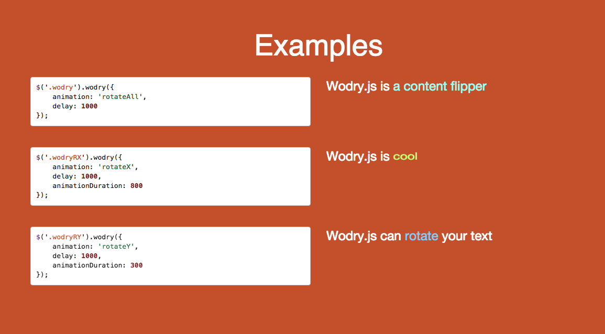

##About

Wodry.js is a simple jQuery plugin for a text flipping/rotating written in CoffeeScript. It was inspired by the Adjector.js. Wodry.js does the same things but it has new features that allow you to set animation from animations collection, set your own callback on content flipping, etc.

<center>[](http://daynin.github.io/wodry/#examples)</center>

##How to get it

You can download this repository or install it from Bower:

```bash
bower install wodry
```

##How it works

In the first place you need to include wodry.css and wodry.js (wodry.min.js) files then create html tag with content that will flip/rotate (like this):

```html

<div>
    Bla bla bla <span class="wodry">word1|word2|word3</span>
</div>

```

And in the script tag add this:

```javascript
$('.wodry').wodry();
```

In this case it will works with default settings. But if you want you can specify settings of wodry.js:

```javascript
$('.wodry').wodry({
    //settings
});
```

Settings object has the following fields:

- **separator**: sets a custom separator between flipped text. **Default value:** "|";
- **delay**: sets a delay of interations. **Default value:** 2000;
- **animationDuration**: sets duration of animation. **Default value:** 500;
- **animation**: sets a type of animation. **Default value:** 'rotateY';
- **callback**: sets a callback that calls on each iteration. **Default value:** an empty function;
- **shift**: specify the X,Y and Z values of shifting. **Default value:** {x:0,y:0,z:0};

List of animations:

- rotateX;
- rotateY;
- rotateAll;
- scaleX;
- scaleY;
- scaleAll;
- clockwise;
- anticlockwise;

##[Examples here](http://daynin.github.io/wodry/#examples)

##Development

###Prerequirements

- [node.js](http://nodejs.org/)
- grunt
    
```bash
    npm install -g grunt-cli
```

When node.js and grunt will be installed you need to run 'npm install' command in a root folder of the project for installation of all dependencies.

For autocompiling .coffeescript to .js run grunt with 'dev' parameter in a root folder of the project:
```bash
    grunt dev
```
For project building run:
```bash
    grunt
```
###Contributions & Issues

All your issues and pull requests are welcome!

